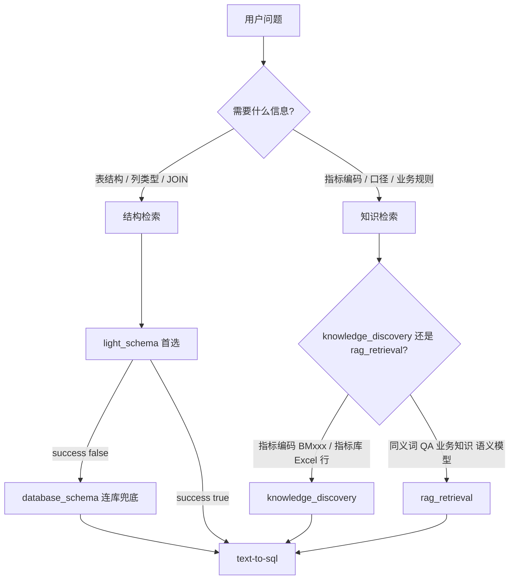
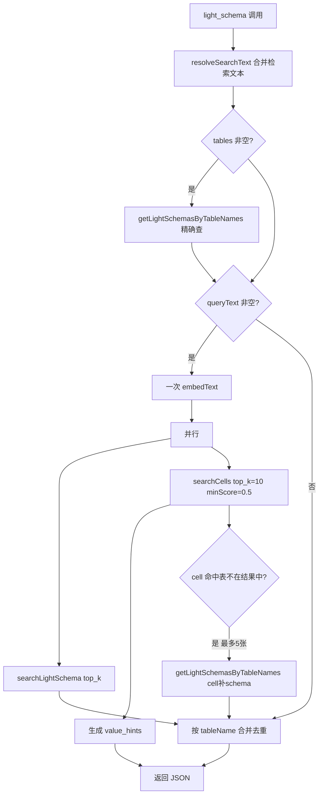
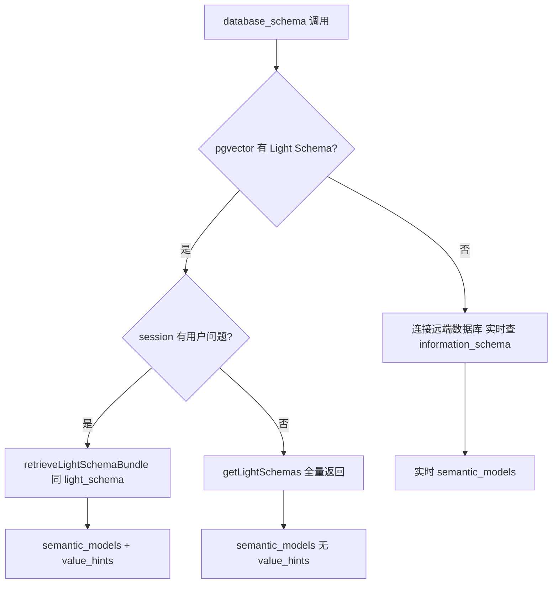

# BeCause 检索触发条件与流程说明

> 本文档描述 Agent 在问数场景下**各类检索能力**的触发条件、内部流程、存储位置与返回字段。  
> 适用版本：Light Schema + Cell 向量接入 `light_schema` 之后（Phase 1）。

---

## 1. 总览：两类检索、五条路径

问数前的信息获取分为**两条主线**，不要混用：

| 主线 | 回答的问题 | 主要工具 | 存储 |
|------|-----------|----------|------|
| **结构 + 值对齐** | 有哪些表/列？WHERE 里字面量写什么？ | `light_schema`（首选）、`database_schema`（兜底） | pgvector：`light_schema_vectors`、`cell_vectors` |
| **业务知识** | 指标口径、同义词、QA、Excel 指标库行 | `rag_retrieval`、`knowledge_discovery` | MongoDB 知识库 + pgvector：`file_vectors` 等 |



**标准问数顺序（推荐）：**

1. `light_schema` — 拿表结构 + `value_hints`（若有 cell 预处理）
2. `rag_retrieval` — 补业务含义（生成 SQL **前**建议调用）
3. （可选）`knowledge_discovery` — 查指标编码/口径类 Excel 知识
4. `text-to-sql` → `sql_validation` → `sql_executor` → `result_analysis`

---

## 2. 预处理前提（决定检索能不能命中）

| 预处理操作 | 管理界面入口 | 写入存储 | 影响哪条检索 |
|-----------|-------------|----------|-------------|
| 生成 Light Schema | 数据源预处理 → Light Schema | `light_schema_vectors`（embed DDL 文本，含列注释、sample_values） | `light_schema`、`database_schema` 缓存路径 |
| 单元格向量化 | 数据源预处理 → 单元格向量化 | `cell_vectors`（embed **单元格值**） | `light_schema`、`database_schema` 缓存路径的 `value_hints` |
| 上传 Excel 指标库 | 数据源 → Excel 文件 | `file_vectors`（`metadata.source=excel_cell`） | `knowledge_discovery`、`rag_retrieval`（文件混合通道） |
| 录入 RAG 知识 | 知识库管理 | `semantic_model_vectors` 等独立表 | `rag_retrieval` |

**未预处理时的表现：**

- 未生成 Light Schema → `light_schema` 返回 `success: false` → 需降级 `database_schema` 连库
- 未做单元格向量化 → 结构检索正常，但 **`value_hints` 为空**，LLM 需自行猜 WHERE 字面量
- 未上传 Excel → `knowledge_discovery` 无结果

---

## 3. light_schema（Schema 获取首选，零 DB 连接）

### 3.1 何时触发（Agent 应调用）

| 条件 | 是否调用 |
|------|----------|
| 生成 SQL 前需要表结构 | ✅ 首选 |
| 不知道涉及哪些表，用业务问题语义找表 | ✅ 传 `query` |
| 已知表名 | ✅ 传 `tables: ["表名"]` |
| 用户问题含维度过滤词（渠道、客户类型、卡种等） | ✅ 传 `query`（同时触发 cell 值对齐） |
| 需要**全部**表结构 | ❌ 改用 `database_schema` |
| 仅为查指标编码 BMxxx | ❌ 用 `knowledge_discovery` |

### 3.2 调用示例

```json
{
  "command": "light-schema",
  "arguments": "{\"query\": \"金卡客户的贷款情况\", \"top_k\": 8}"
}
```

已知表名：

```json
{
  "command": "light-schema",
  "arguments": "{\"query\": \"\", \"tables\": [\"card\", \"loan\"]}"
}
```

### 3.3 内部流程（`retrieveLightSchemaBundle`）

检索文本来源（优先级）：`arguments.query` → `req.body.text/message/content` → session 用户原话。



**合并优先级：** 精确（`tables[]`）> 语义（`searchLightSchema`）> cell 补表（`cell_boost`）

### 3.4 返回字段

| 字段 | 含义 |
|------|------|
| `semantic_models` | 表结构数组，供 text-to-sql |
| `value_hints` | 如 `card.type = "gold", loan.status = "C"`，写 WHERE 用 |
| `retrieval_info.exact_match` | 精确模式命中的表 |
| `retrieval_info.semantic_match` | 语义检索命中的表 |
| `retrieval_info.cell_matches` | 结构化 cell 命中列表 |
| `retrieval_info.cell_table_boost` | 因 cell 命中而额外补拉的表 |

### 3.5 完整示例：「金卡客户的贷款情况」

**前提：** 已生成 Light Schema + 已对 `card`、`loan` 等表做单元格向量化。

| 步骤 | 动作 | 可能结果 |
|------|------|----------|
| 1 | `searchLightSchema("金卡客户的贷款情况", top_k=8)` | 语义命中 `loan` |
| 2 | `searchCells(同一 embedding)` | 命中 `card.type = "gold"` |
| 3 | `card` 不在步骤 1 结果中 | cell 补拉 `card` 的 Light Schema |
| 4 | 合并返回 | `semantic_models`: loan + card；`value_hints`: `card.type = "gold"` |

Agent 生成 SQL 时可写：

```sql
SELECT ...
FROM loan l
JOIN disp d ON ...
JOIN card c ON ...
WHERE c.type = 'gold'
```

**注意：** 「金卡」→ `gold` 依赖向量相似度；若未命中，`value_hints` 为空，但 `sample_values` 中可能有 `["gold","classic","junior"]` 供参考。

---

## 4. database_schema（兜底，可连库）

### 4.1 何时触发

| 条件 | 是否调用 |
|------|----------|
| `light_schema` 返回 `success: false` | ✅ |
| 需要最新实时结构（预处理过期） | ✅ |
| 用户明确要求连库查结构 | ✅ |
| 仅为值对齐 | ❌ 不需要；用 `light_schema` |

### 4.2 内部流程（决策树）



**要点：**

- 有 Light Schema 缓存时，**同样走 pgvector**，不连库（与 `light_schema` 共用 `retrieveLightSchemaBundle`）
- 仅当缓存为空时才连远端 DB
- 有用户问题时：schema 语义过滤 + cell 值对齐 + cell 补表（与 `light_schema` 一致）

### 4.3 与 light_schema 的差异

| 维度 | light_schema | database_schema |
|------|-------------|-----------------|
| 默认 Agent 优先级 | 首选 | 兜底 |
| 缓存命中时 | 仅 pgvector | 仅 pgvector（相同 bundle） |
| 缓存未命中 | 返回失败，建议降级 | **连库**查实时结构 |
| 无用户问题时 | 仅精确/语义（取决于参数） | 可**全量**返回所有表（小型库） |

---

## 5. Cell 向量 vs sample_values vs knowledge_discovery

三者都涉及「值」，但用途不同：

| 能力 | 存储 | embed 内容 | 触发工具 | 返回形式 | 典型场景 |
|------|------|-----------|----------|----------|----------|
| **sample_values** | Light Schema JSON 内 | 随 DDL 一起参与表级 embed | `light_schema` 的 `semantic_models` 列字段 | 每列最多几个采样值 | 了解列大致枚举 |
| **cell_vectors** | `cell_vectors` 表 | 单个 **cell_value** | `light_schema` / `database_schema` 缓存 | `value_hints` | WHERE 字面量对齐 |
| **Excel 行向量** | `file_vectors` | Excel 单元格 + 整行 metadata | `knowledge_discovery` | 完整行 `full_row` | 指标编码、口径表 |

**不要混用：**

- 查 `BM10012529` 指标定义 → `knowledge_discovery`，不是 cell 向量
- 写 SQL 过滤 `card.type='gold'` → `light_schema` 的 `value_hints`，不是 `rag_retrieval`

---

## 6. rag_retrieval（业务知识检索）

### 6.1 何时触发

| 条件 | 是否调用 |
|------|----------|
| 生成 SQL **前**补充业务逻辑 | ✅ 推荐 |
| 不理解专业术语 / 缩写 / 业务概念 | ✅ |
| 需要同义词、QA 对、业务知识 | ✅ |
| 查指标编码精确行 | ❌ 用 `knowledge_discovery` |
| 查表结构 | ❌ 用 `light_schema` |

### 6.2 内部流程

```
query → embed → 多表向量检索（semantic_model / qa_pair / synonym / business_knowledge）
     → 可选 rerank（默认 top_k×2 候选 → 重排 → top_k）
     → 若有 entityId：混合检索 file_vectors（含 Excel 单元格，约 30% 配额）
```

### 6.3 调用示例

```json
{
  "command": "rag-retrieval",
  "arguments": "{\"query\": \"存款余额 字段含义\", \"top_k\": 10, \"use_reranking\": true}"
}
```

---

## 7. knowledge_discovery（Excel 结构化知识行）

### 7.1 何时触发

| 条件 | 是否调用 |
|------|----------|
| 指标编码如 `BM10012529` | ✅ 优先 |
| 指标名称 / 口径 / 计算公式 | ✅ |
| 需要 Excel 指标库**完整一行** | ✅ |
| 查数据库表结构 | ❌ |
| 查数据库维度枚举值（已在 DB 中的 distinct 值） | ❌ 用 cell 向量（需预处理） |

### 7.2 内部流程

```
query → ILIKE 文本包含匹配（主列 score=1.0）
     → 向量语义检索（min_score 默认 0.4）
     → 按 Excel 行去重（filename + sheet + row_index）
     → 返回 full_row
```

### 7.3 调用示例

```json
{
  "command": "knowledge-discovery",
  "arguments": "{\"query\": \"BM10012529\", \"top_k\": 5}"
}
```

---

## 8. 端到端示例：三类典型问题

### 示例 A：维度过滤问数（cell + schema）

**用户：** 「classic 卡上周交易笔数是多少？」

```
1. light_schema(query="classic 卡上周交易笔数", top_k=8)
   → semantic_models: trans, card, disp ...
   → value_hints: card.type = "classic"

2. rag_retrieval(query="交易笔数 业务含义")

3. text-to-sql(semantic_models + value_hints + RAG 结果)
   → WHERE card.type = 'classic' AND ...

4. sql_validation → sql_executor → result_analysis
```

### 示例 B：指标口径（Excel 知识，不走 cell）

**用户：** 「BM10012529 这个指标的口径是什么？」

```
1. knowledge_discovery(query="BM10012529")
   → full_row 含指标名称、口径、公式等

2. （若需关联 DB 字段）light_schema(query="存款", top_k=5)

3. 直接回答或继续 text-to-sql
```

**不调用：** cell 向量（与 DB 维度枚举无关）

### 示例 C：预处理未做（降级连库）

**用户：** 「查一下 orders 表结构」

```
1. light_schema(tables=["orders"])
   → success: false（未生成 Light Schema）

2. database_schema(format="semantic", table="orders")
   → 连库查 information_schema → semantic_models
```

---

## 9. 快速对照表（Agent 决策）

| 用户意图 | 第一个该调的工具 | 关键返回 |
|----------|----------------|----------|
| 哪些表/什么列/怎么 JOIN | `light_schema` | `semantic_models` |
| WHERE 写什么枚举值 | `light_schema`（需 cell 预处理） | `value_hints` |
| 指标编码 / 口径 / Excel 行 | `knowledge_discovery` | `full_row` |
| 业务术语 / 同义词 / QA | `rag_retrieval` | 知识条目 |
| light_schema 失败 | `database_schema` | `semantic_models` |
| 为什么指标涨跌 | `fluctuation_attribution` | 归因结果 |

---

## 10. 参数默认值速查

| 工具 | 参数 | 默认值 | 上限 |
|------|------|--------|------|
| light_schema | top_k | 8 | 20 |
| light_schema | cell 检索（内部） | top_k=10, minScore=0.5 | — |
| light_schema | cell 补表 | 最多 5 张 | — |
| database_schema 缓存 | schemaTopK | 15 | — |
| rag_retrieval | top_k | 10 | 50 |
| knowledge_discovery | top_k | 5 | 20 |
| knowledge_discovery | min_score | 0.4 | 1.0 |

---

## 11. 相关源码

| 模块 | 路径 |
|------|------|
| 联合检索编排 | `Because-2.0/utils/lightSchemaRetrieval.js` |
| Light Schema 工具 | `Because-2.0/light-schema-tool/scripts/LightSchemaTool.js` |
| Database Schema 工具 | `Because-2.0/database-schema-tool/scripts/DatabaseSchemaTool.js` |
| pgvector 服务 | `api/server/services/RAG/VectorDBService.js` |
| Cell 向量化写入 | `api/server/services/CellVectorizationService.js` |
| Excel 行检索 | `api/server/services/Files/ExcelCellVectorizationService.js` |
| Agent 策略说明 | `Because-2.0/instructions.md` |

---

*文档随 Phase 1（cell 接入 light_schema）更新；Phase 2（searchCells ILIKE 混合检索）尚未实现。*
